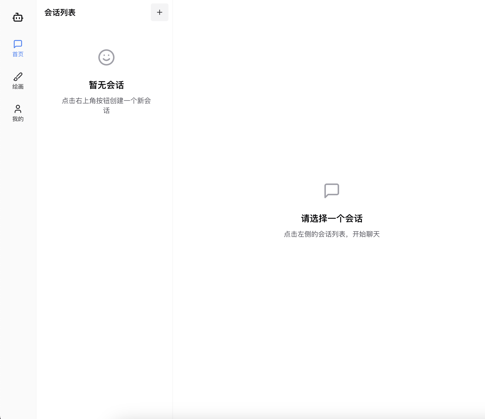
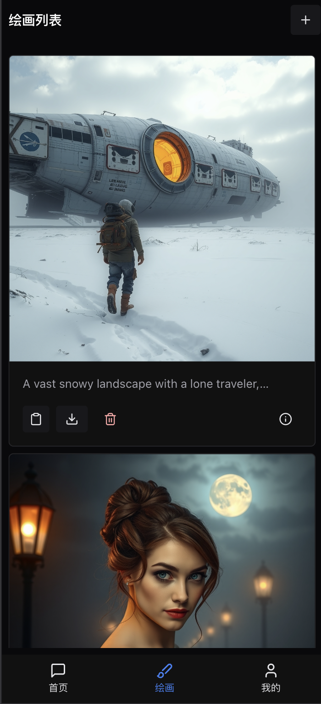
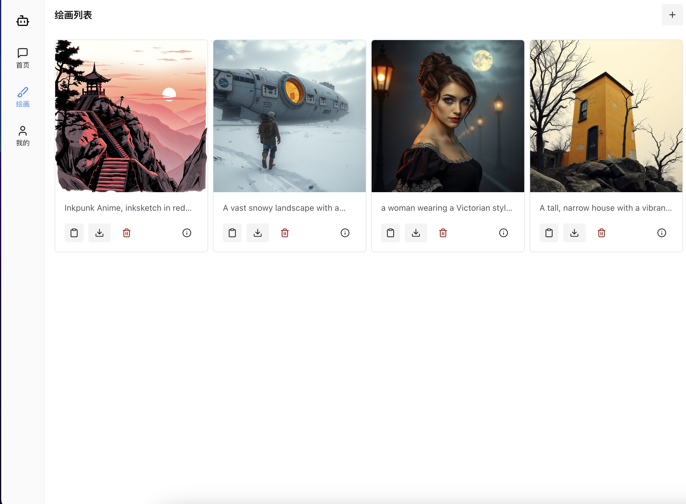
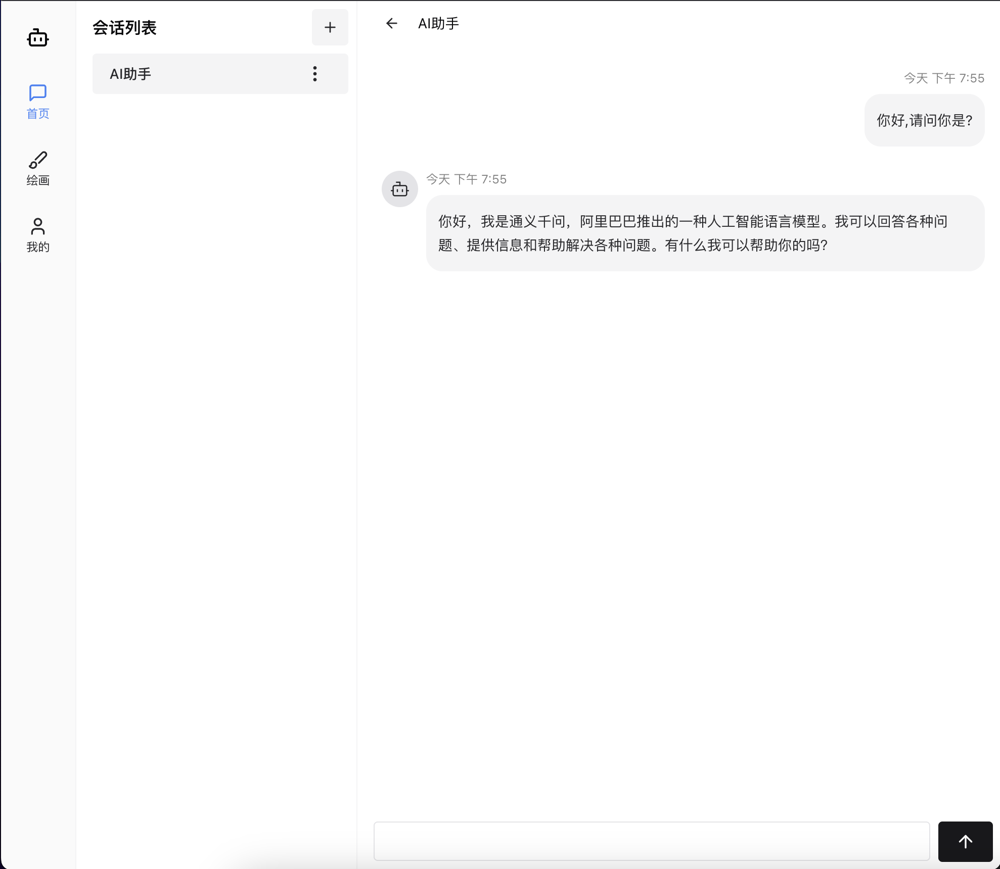

# openchat-web

## 项目简介

openchat-web是一个基于react router v7、chakra-ui、tanstack query、ky、zod的前端AI Chatbot项目。

## 配套后端地址: https://github.com/akazwz/openchat-go

### 功能特色

- **自适应** 支持PC端、移动端。
- **AI绘画** 支持AI绘画。
- **AI聊天** 支持AI聊天。
- **用户认证系统** 支持登录、注册。
- **token刷新** 支持token过期自动刷新。

### 用到了什么
1. react router v7, prerender
2. chakra-ui
3. tanstack query
4. ky
5. zod

### 截图
 
 
 
 
